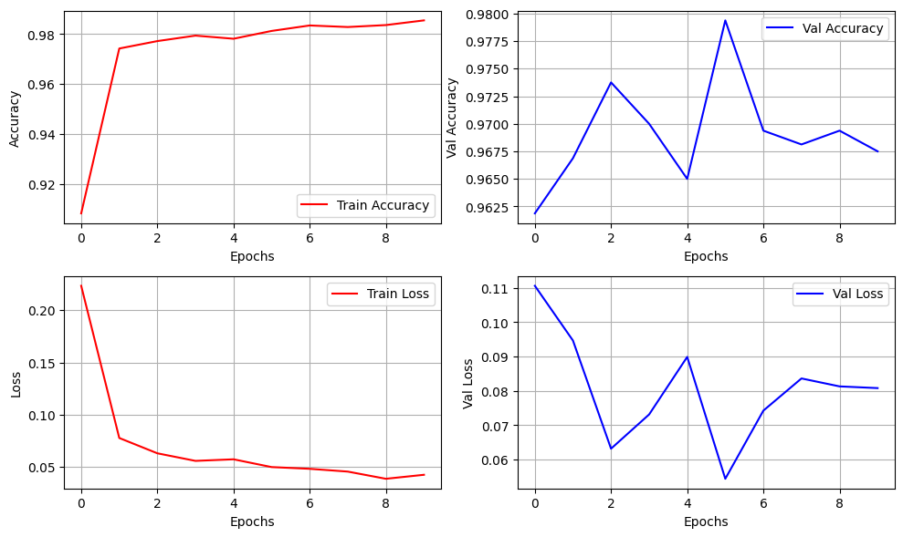
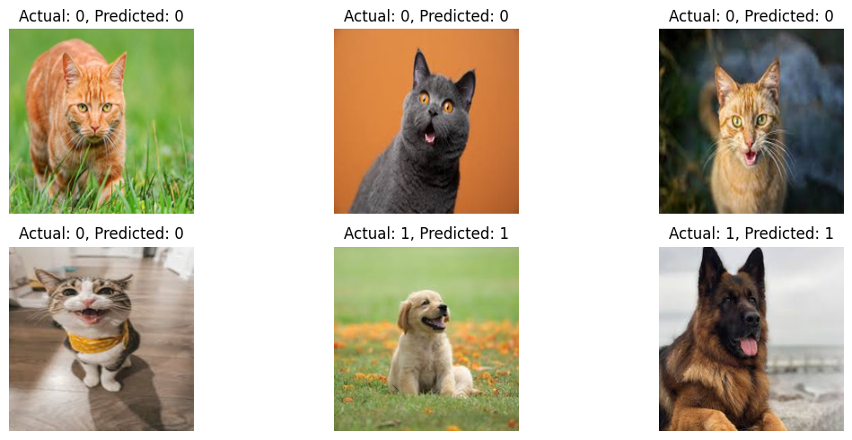

# Cat vs Dog Classifier Using MobileNetV2 (Transfer Learning)

This project uses a pretrained **MobileNetV2** model from Keras applications to classify images of **cats (label 0)** and **dogs (label 1)**. Transfer learning allows the model to leverage pretrained image features while focusing on task-specific classification with a lightweight custom head.

---

## 📁 Files Included

* `Module_MobileNetV2.py`: Full training and evaluation pipeline (data loading, preprocessing, training, evaluation, inference).
* `fit_result.png`: Training/validation accuracy and loss curves.
* `module_test.png`: Visualization of predictions on test images.

---

## 🌐 Dataset

* Source: Hugging Face Dataset [`Bingsu/Cat_and_Dog`](https://huggingface.co/datasets/Bingsu/Cat_and_Dog)
* Format: Parquet files containing images in byte format and binary labels.
* Preprocessing: Resizing images to 224x224, normalized to \[0,1].

---

## 🧠 Model Architecture

```text
Input: 224x224x3
└️ Pretrained MobileNetV2 (frozen)
    └️ GlobalAveragePooling2D
        └️ Dropout(0.5)
            └️ Dense(64, relu)
                └️ Dropout(0.5)
                    └️ Dense(1, sigmoid)
```

* Loss Function: `binary_crossentropy`
* Optimizer: `Adam`
* Regularization: `Dropout(0.5)` for both dense layers
* EarlyStopping used on validation loss with patience = 4

---

## 🏋️ Training Results

Model trained on 80% of available data with validation\_split=0.2:



* **Training Accuracy** exceeded 98%
* **Validation Accuracy** peaked around 97.8%
* Overfitting is minimal thanks to frozen base model and regularization

---

## 🔍 Inference on Custom Images

Predictions from 6 external test images:



**Results:**

* All cat images predicted correctly as class 0
* All dog images predicted correctly as class 1
* No misclassifications observed on this small sample

---

## ✅ Highlights

* Excellent generalization on test images
* Fast convergence due to transfer learning
* Model benefits from pre-trained MobileNetV2 features

---

## 🚫 Limitations

* No image augmentation used (can improve robustness)
* Base model was frozen (could try fine-tuning upper layers)
* Dataset size was relatively small (limited examples per class)

---

## 🔹 Suggestions for Improvement

* Add `ImageDataGenerator` for data augmentation
* Fine-tune last few layers of MobileNetV2
* Use more diverse and noisy samples for evaluation
* Add class activation maps (CAM) for interpretability

---

## 🏰 Project Name

**MobileNetV2-CatDogClassifier**
*Transfer Learning–based Cat/Dog classification using MobileNetV2.*

---

## ✍️ Author

Documented and implemented by **M.A.Saada**
